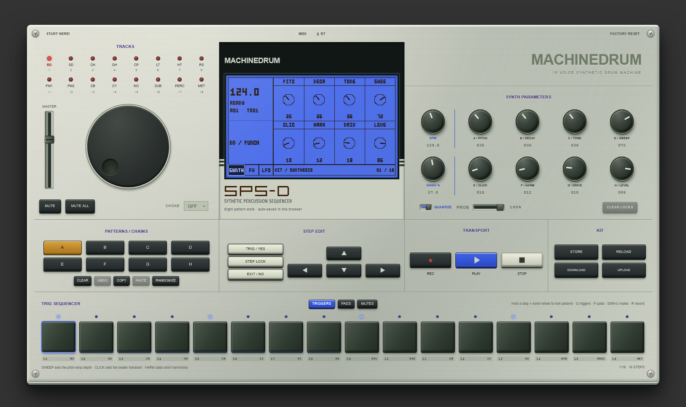
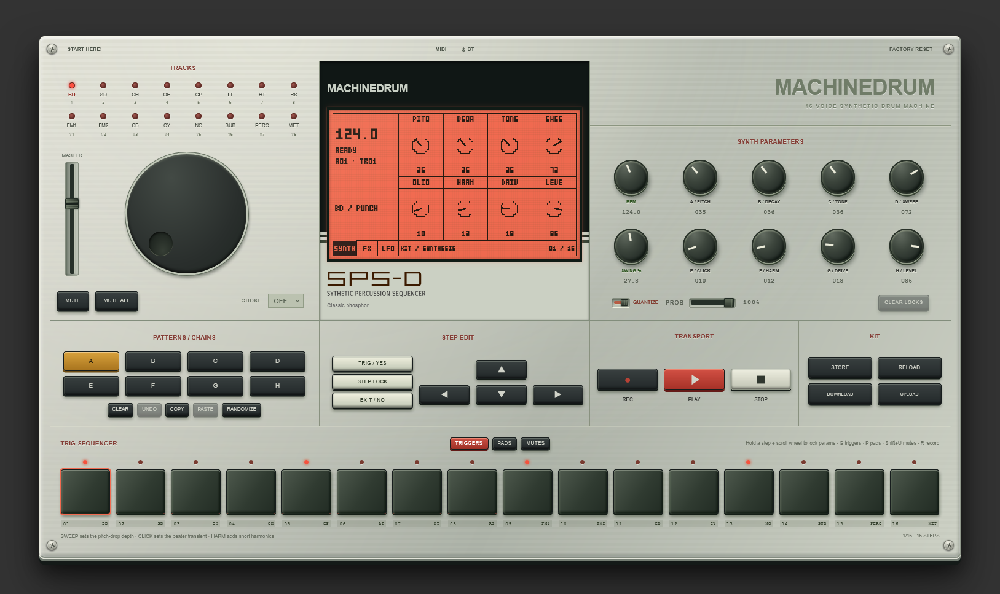

# MACHINEDRUM

**A 16-voice digital drum machine that lives in your browser.** Synthesised in real time — no samples, no plugins, no install. Open the page and it keeps working even after you go offline.

<p align="center">
  <a href="https://omodaka9375.github.io/machinedrum/"><strong>▸ OPEN THE MACHINE</strong></a>
</p>

<p align="center">
  
</p>

<p align="center">
  <em>The blue “UW” face. Click the MACHINEDRUM name above the screen to flip it to the classic green phosphor — the machine remembers your choice.</em>
</p>

---

## What you get

A single screen, modeled after the classic hardware grooveboxes — with everything one knob-turn away:

| | |
|---|---|
| 🥁 **16 synthesized voices** | Kick, snare, hats, claps, toms, rim, FM percussion, noise — each with 8 knobs (pitch, decay, tone, sweep, noise, FM, drive, level) |
| 🎹 **16-track × 16-step sequencer** | Click or drag steps, chain up to all 8 patterns into a live loop |
| 🎛️ **Per-step sound locks** | Hold a step + turn a knob: that one step gets its own sound |
| 🎲 **Play probability** | Give any step a chance to fire — the loop keeps evolving while it runs |
| 🌊 **Delay + reverb** | Per-track sends, master effect controls, per-step FX locks |
| 📶 **Per-track LFO** | Wave, speed, depth, phase — modulating pitch, level, filter or pan |
| 🔊 **Stereo field out of the box** | The kit ships pre-spread; kick and snare anchor the center while hats, toms and percussion answer from the sides |
| 🎹 **MIDI in/out** | Web MIDI (USB) + direct Bluetooth pairing; GM drum map, transport sync, pattern switching |
| 💾 **Instant persistence** | Everything auto-saves to your browser; kits export/import as a small JSON file
| 📱 **Installable PWA** | Installs as an app, then runs fully offline — service worker precaches the whole machine |

## Play it in 30 seconds

1. **Pick a sound** — number keys `1`–`8` (`Shift` for 9–16), or click a track on the left
2. **Light up steps** — keys `Z X C V B N M ,`, or click cells in the grid
3. **Hit `Space`** — the eight pattern slots A–H each start as a different ready-made groove
4. **Turn knobs** — drag or scroll; `Shift` for fine steps

Want a head start? Press **RANDOMIZE**: every empty track draws a groove from its role — the kick/snare backbone stays solid, while hats, toms and percussion get maybe-hits so the pattern never repeats exactly.

<p align="center">
  
</p>

## The three knob pages

The same eight panel knobs become different controls per page — switch on the screen itself:

- **SYNTH** — the track's sound. Eight params per voice, plus global **BPM** and **SWING** knobs that stay on every page
- **FX** — delay + reverb sends and returns, plus stereo **PAN** per track
- **LFO** — a per-track modulator: wave, destination, speed, depth, phase, tempo sync, retrigger mode

Per-step? Hold a step and turn a knob (or press `L` for step lock). The step gets its own value; the rest of the track is untouched.

## Everything is a keyboard shortcut

The full field guide lives inside the machine (the **GUIDE** button on the panel), but the essentials:

| Keys | Does |
|---|---|
| `1`–`8` / `Shift` | select track (both banks of 8) |
| `Z X C V B N M ,` | toggle steps · `Tab` flips front/back 8 |
| `Space` | play / stop · `Enter` audition |
| `L` / `Esc` | step lock on / off |
| `P` `R` `U` | pads · record · mutes (`G` returns to the grid) |
| `Ctrl+Shift+1–8` | switch pattern A–H · `Shift+click` a pattern to chain it |
| Hold step + `Shift+wheel` | set that step's play probability |

## Under the hood

No framework, no runtime dependencies — plain ES modules on the Web Audio API. A lookahead scheduler drives sample-accurate timing; every voice is a hand-built node graph that self-cleans after it sounds.

```
src/
├── model.js   the data model — kit, patterns, saves (pure, no browser)
├── audio.js   the engine — lookahead scheduler, voices, recording
├── drums.js   the four extended drum engines (kick/snare/hat/FM)
├── fx.js      delay + convolution reverb, per-step FX resolution
├── lfo.js     per-track LFO rendered to a curve
├── midi.js    Web MIDI + BLE MIDI parsers (pure & fully tested)
├── app.js     the panel — state, rendering, gestures, MIDI wiring
└── info.js    the in-app field guide
```

**Build & verify** (pnpm 10):

```bash
pnpm install
pnpm run check     # typecheck + the full 224-assertion test gate
pnpm run dev       # http://localhost:5173
pnpm run build     # → dist/, an installable offline PWA
pnpm run preview   # serve the build at http://localhost:4174
```

The test suites cover the pure modules directly (parsing, scheduling shapes, migrations) and verify the DOM-bound logic by extracting it verbatim and running it against browser stubs — 9 suites, zero test-framework dependencies.

## Install it as an app

Chrome and Edge offer the install icon right in the address bar (or ⋮ → *Cast, save, and share → Install page as app*). Installed, MACHINEDRUM opens in its own window, keeps working offline, and survives a wiped cache — the service worker precaches every asset.

## License

Released under the [MIT License](LICENSE). Built as a study of the classic hardware — an original tribute, not an emulation.
